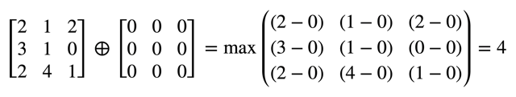

# Adding a Bokeh Effect

Simulate a bokeh effect by applying dilation.

## Overview

To create a bokeh effect, where parts of an image that are out-of-focus adopt the shape of the lens' aperture, this sample app dynamically generates a polygon-shaped kernel—also known as a _structuring element_—and applies a morphological operation to an image based on that kernel. The following sample shows a photograph dilated with a triangle-shaped kernel:


Morphological operations are built on kernels that change the value of a pixel based on the intensity of its neighbors. 

 There are two basic types of morphological operations:

* Dilation, which expands bright areas of an image.
* Erosion, which expands dark areas of an image.

Kernels are 1D or 2D grids of values that the morphological operation subtracts from a corresponding pixel value in the image. The final value of each transformed pixel is either the lightest (for dilation) or darkest (for erosion) result of each subtraction.


The following formula shows how a dilation operation calculates the value for the pixel at the center of the grid. The operation subtracts each of the nine kernel values from the image's corresponding pixel and returns the maximum value.


## Generate the Structuring Element

The [`makeStructuringElement(ofRadius:withSides:)`](x-source-tag://makeStructuringElement) method returns a kernel populated with [`UInt8`](https://developer.apple.com/documentation/swift/uint8) values that's suitable for use with an integer format image. For example, to create a hexagon-shaped bokeh effect, call the `makeStructuringElement(ofRadius:withSides:)` method and set the number of sides to 6:

``` swift
var numSides = 6
```
``` swift
let kernel = ViewController.makeStructuringElement(ofRadius: radius,
                                                   withSides: numSides)
```

On return, `kernel` contains the following values:


## Apply the Dilation

To apply the dilation to a vImage buffer, call [`vImageDilate_ARGB8888`](https://developer.apple.com/documentation/accelerate/1545760-vimagedilate_argb8888), passing the kernel returned by `makeStructuringElement(ofRadius:withSides:)`:

``` swift
let diameter = vImagePixelCount(radius * 2) + 1

vImageDilate_ARGB8888(&sourceBuffer,
                      &destinationBuffer,
                      0, 0,
                      kernel,
                      diameter,
                      diameter,
                      vImage_Flags(kvImageNoFlags))
```

On return, the destination buffer contains the dilation result:


## Maximize an Image

vImage provides a maximize filter that returns the brightest pixel in an area covered by the kernel. The maximize filter applies dilation to the image using a kernel populated with a single value. vImage optimizes this special case—where all kernel values are the same—so that it is considerably faster than the dilate function with a uniform kernel. 

The following formula shows an image maximized by a 3 x 3 max kernel:



To maximize an image, call [`vImageMax_ARGB8888`](https://developer.apple.com/documentation/accelerate/1546943-vimagemax_argb8888), by passing it the height and width of the kernel:

``` swift
vImageMax_ARGB8888(&sourceBuffer,
                   &destinationBuffer,
                   nil,
                   0, 0,
                   diameter,
                   diameter,
                   vImage_Flags(kvImageNoFlags))
```

In this example, the kernel height and width are the same value. As a result, the bright areas of the image appear as large squares:


