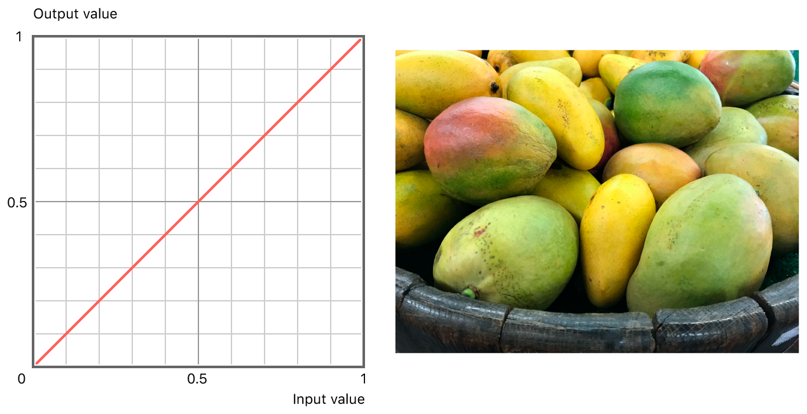
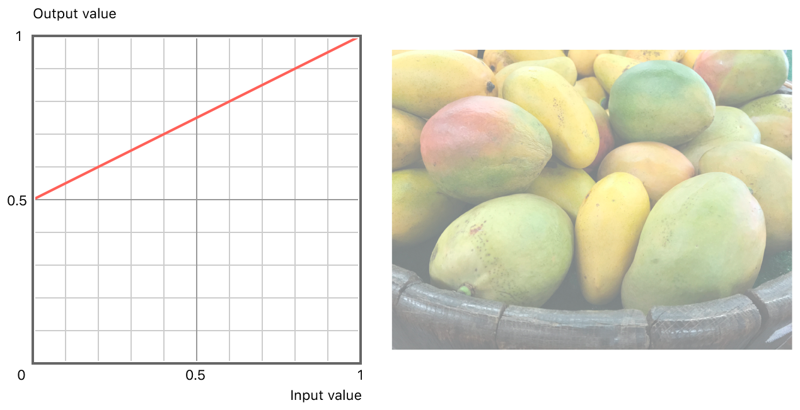
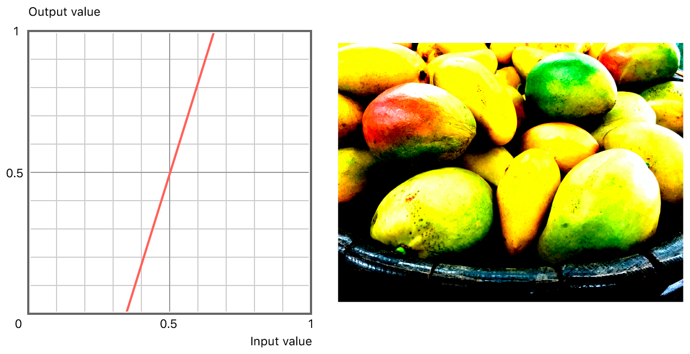
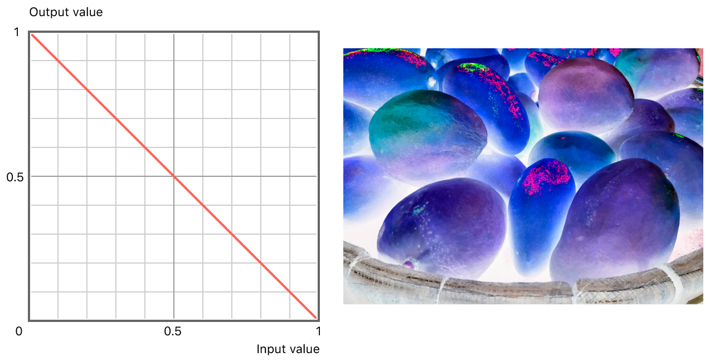
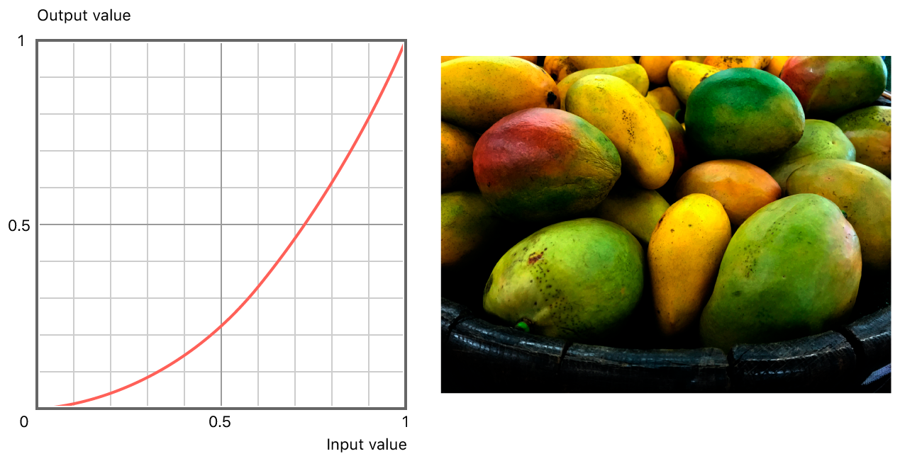
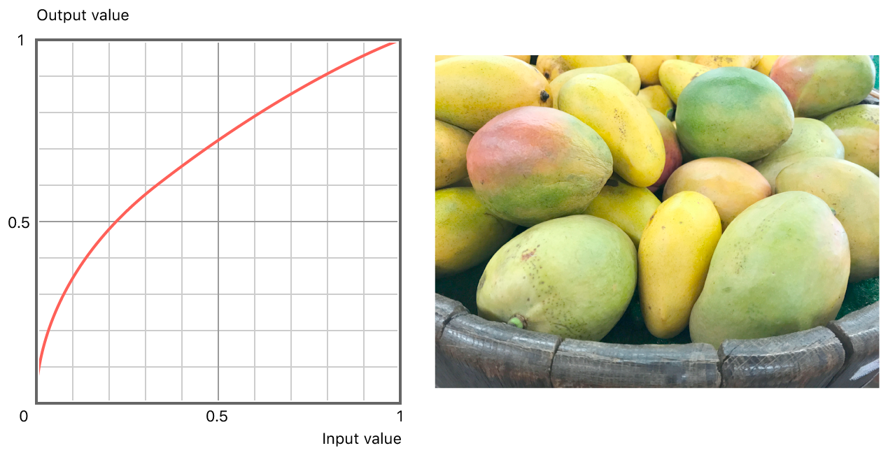

# Adjusting the Brightness and Contrast of an Image

Use a gamma function to apply a linear or exponential curve.

## Overview

This sample code project uses the vImage piecewise gamma function to adjust the response curve (that is, the value of an output pixel based on the value of the corresponding input pixel) of an 8-bit ARGB image. Changing the shape of the response curve changes the brightness and contrast of an image. 

A piecewise gamma function allows you to apply a either linear or exponential response curve to pixels in an image based their value.

This app displays a sample image and uses a segmented control to apply different preset linear (labelled L1 to L4) and exponential (labelled E1 to E3) response curves. In this sample, you'll learn how different response curves affect an image by changing its brightness and contrast.

## Define Response Curve Presets

This sample app defines a structure, `ResponseCurvePreset`, that contains the coefficients used by the linear function, the gamma used by the exponential function, and the boundary between the linear and exponential functions:

``` swift
struct ResponseCurvePreset {
    let label: String
    let boundary: Pixel_8
    let linearCoefficients: [Float]
    let gamma: Float
}
```

The `presets` array contains sample presets that apply different adjustments to the sample image.

When the user changes the selected segment of the segmented control, the appropriate `preset` structure is passed to `getGammaCorrectedImage(preset:)` which applies the adjustment to the image and displays the result.

## Define the Adjustment Parameters

You specify the division between linear and gamma adjustments by passing a boundary parameter to the piecewise gamma function, [`vImagePiecewiseGamma_Planar8`](https://developer.apple.com/documentation/accelerate/1546371-vimagepiecewisegamma_planar8). The function uses the gamma curve to calculate the output value when the input value is greater than or equal to the boundary value. Otherwise, the function uses the linear curve.

For 8-bit images, the boundary is a `Pixel_8` value, so a value of `0` indicates all pixels are gamma adjusted, a value of `255` indicates all pixels are linearly adjusted, and a value of `127` indicates all pixels with a value less than one-half are linearly adjusted.

``` swift
let boundary: Pixel_8 = preset.boundary
```

You pass the linear and exponential coefficients (for example, the `a` and `b` in `(a * inputvalue) + b`) as arrays of floating-point values:

``` swift
let linearCoefficients: [Float] = preset.linearCoefficients

let exponentialCoefficients: [Float] = [1, 0, 0]
let gamma: Float = preset.gamma
```

## Remove the Alpha Channel

The `vImagePiecewiseGamma_Planar8` function used in this sample treats the interleaved RGBA buffer as a single plane, applying the same gamma adjustment to all channels—including the alpha channel. Adjusting the response curve of the alpha channel changes transparency properties. To avoid this, convert the RGBA source image to RGB and apply the adjustment to that. 

Create the RGB version of the source image by creating a 3-channel, 8-bit format:

``` swift
lazy var rgbFormat: vImage_CGImageFormat = {
    return vImage_CGImageFormat(
        bitsPerComponent: 8,
        bitsPerPixel: 8 * 3,
        colorSpace: Unmanaged.passRetained(CGColorSpaceCreateDeviceRGB()),
        bitmapInfo: CGBitmapInfo(rawValue: CGImageAlphaInfo.none.rawValue),
        version: 0,
        decode: nil,
        renderingIntent: .defaultIntent)
}()
```

Create a 3-channel destination buffer using the source buffer's dimensions and the RGB format's [`bitsPerPixel`](https://developer.apple.com/documentation/accelerate/vimage_cgimageformat/1399088-bitsperpixel) value:

``` swift
lazy var destinationBuffer: vImage_Buffer = {
    var destinationBuffer = vImage_Buffer()
    
    vImageBuffer_Init(&destinationBuffer,
                      sourceBuffer.height,
                      sourceBuffer.width,
                      rgbFormat.bitsPerPixel,
                      vImage_Flags(kvImageNoFlags))
    
    return destinationBuffer
}()
```

Use the [`vImageConvert_RGBA8888toRGB888`](https://developer.apple.com/documentation/accelerate/1533062-vimageconvert_rgba8888torgb888) to populate the destination with only the color channels:

``` swift
vImageConvert_RGBA8888toRGB888(&sourceBuffer,
                               &destinationBuffer,
                               vImage_Flags(kvImageNoFlags))
```

On return, `destinationBuffer` contains the red, green, and blue channels of `sourceBuffer`.

## Prepare the Buffers

The [`vImagePiecewiseGamma_Planar8`](https://developer.apple.com/documentation/accelerate/1546371-vimagepiecewisegamma_planar8) function expects planar buffers. Create a planar representation of the RGB buffer that is three times its width to pass to the piecewise gamma function:

``` swift
var planarDestination = vImage_Buffer(data: destinationBuffer.data,
                                      height: destinationBuffer.height,
                                      width: destinationBuffer.width * 3,
                                      rowBytes: destinationBuffer.rowBytes)

```

This approach applies the same adjustment to all three channels of your interleaved buffer. If you need to separate the interleaved buffer to individual planar buffers (for example, to adjust individual colors with different parameters), see [Optimizing Image Processing Performance](https://developer.apple.com/documentation/accelerate/vimage/optimizing_image_processing_performance).

## Apply the Adjustment

With the parameters and buffers prepared, call `vImagePiecewiseGamma_Planar8` to apply the adjustment. Because the piecewise gamma function can work in place, you can use `planarDestination` as the source and destination:

``` swift
vImagePiecewiseGamma_Planar8(&planarDestination,
                             &planarDestination,
                             exponentialCoefficients,
                             gamma,
                             linearCoefficients,
                             boundary,
                             vImage_Flags(kvImageNoFlags))
```

To create the image, pass the destination buffer and RGB format to [`vImageCreateCGImageFromBuffer`](https://developer.apple.com/documentation/accelerate/1399036-vimagecreatecgimagefrombuffer):

``` swift
let result = vImageCreateCGImageFromBuffer(
    &destinationBuffer,
    &rgbFormat,
    nil,
    nil,
    vImage_Flags(kvImageNoFlags),
    nil)
```

The following explains the presets in more detail: 

## Apply Linear Adjustment

The following presets use the linear adjustment (that is, `boundary` is 255). The output value for each pixel is calculated as: 
```
(linearCoefficients[0] * inputValue) + linearCoefficients[1]
```

The `L1` preset returns each pixel unchanged:
``` swift
ResponseCurvePreset(label: "L1",
                    boundary: 255,
                    linearCoefficients: [1, 0],
                    gamma: 0),
```


The `L2` preset returns a washed out image where blacks are transformed to grays. When the input value is `0`, the output value is `0.5`:
``` swift
ResponseCurvePreset(label: "L2",
                    boundary: 255,
                    linearCoefficients: [0.5, 0.5],
                    gamma: 0),
```


The `L3` preset returns a an image with a lot of contrast. When the input value is less than one-third, the output value is `0`; when the input value is greater than two-thirds, the output value is `1`:
``` swift
ResponseCurvePreset(label: "L3",
                    boundary: 255,
                    linearCoefficients: [3, -1],
                    gamma: 0),
```


The `L4` preset returns a negative version of the image. When the input value is `1`, the output value is `0`; when the input value is `0`, the output value is `1`.
``` swift
ResponseCurvePreset(label: "L4",
                    boundary: 255,
                    linearCoefficients: [-1, 1],
                    gamma: 0),
```


## Apply Exponential Adjustment

The following presets use the exponential adjustment (that is, `boundary` is 0). The output value for each pixel is calculated as:
```
pow((exponentialCoefficients[0] * inputValue) + exponentialCoefficients[1], gamma) + exponentialCoefficients[2]
```
In these examples, `exponentialCoefficients` is defined as `[1, 0, 0]` and the calculation can be simplified to `pow(inputValue, gamma)`.

The `E1` preset returns each pixel unchanged:
``` swift
ResponseCurvePreset(label: "E1",
                    boundary: 0,
                    linearCoefficients: [1, 0],
                    gamma: 1),
```


The `E2` preset has an overall darkening effect:
``` swift
ResponseCurvePreset(label: "E2",
                    boundary: 0,
                    linearCoefficients: [1, 0],
                    gamma: 2.2),
```


The `E3` preset has an overall lightening effect:
``` swift
ResponseCurvePreset(label: "E3",
                    boundary: 0,
                    linearCoefficients: [1, 0],
                    gamma: 1 / 2.2)
```


## Correct Gamma Before Applying Operations

Many vImage operations—such as convolution and scaling—provide optimal results when working on images with a linear response curve. If you are working with nonlinear images—such as sRGB—consider converting them to a linear color space by applying a reciprocal gamma (such as `1/2.2`), performing the operation, and converting them back to their original domain by applying the original gamma (such as `2.2`).
