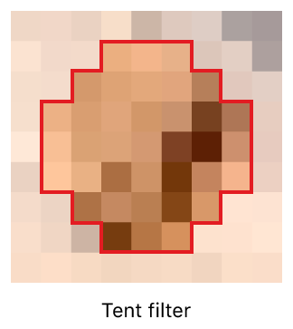
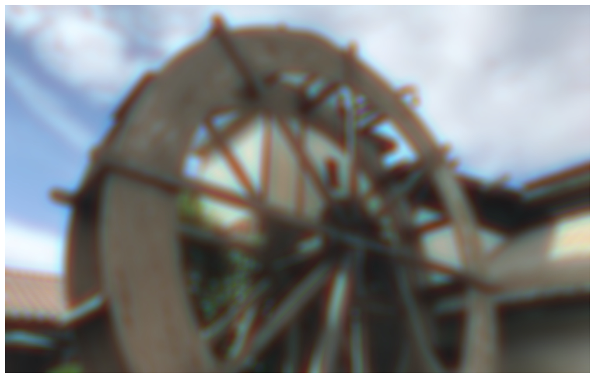

# Blurring an Image

Filter an image by convolving it with custom and high-speed kernels.

## Overview

This sample code project uses a variety of convolution techniques to blur images with custom kernels and built-in high-speed kernels. Convolution is a common image processing technique that changes the value of a pixel based on the values of its surrounding pixels. Many common image filters, such as blurring, detecting edges, sharpening, and embossing, are based on convolution.

Convolution operations are built on _kernels_. Kernels are 1D or 2D grids of numbers that indicate the influence of a pixel's neighbors on its final value. To calculate the value of each transformed pixel, add the products of each surrounding pixel value with the corresponding kernel value. During a convolution operation, the kernel passes over every pixel in the image, repeating this procedure, and applies the effect to the entire image.


Kernels don't need to have the same height and width and can be 1D (that is, either the height or the width is one) or 2D (that is, both the height and the width are greater than one). When transforming a pixel, both dimensions must be odd numbers to center the kernel over the pixel.

The simplest kernel, known as an _identity kernel_, contains a single value: 1. The following formula shows the result when you apply the kernel to the central value in a grid of nine values. Here, you multiply the pixel by the central value in the convolution kernel, and then multiply the surrounding pixel values by zero. The sum of these values is 0.5:


An image remains unchanged when convolved by an identity kernel.

## Blur an Image with a 2D Kernel

A box blur kernel returns the average value of the neighboring pixels. In this example, the kernel contains nine values and the result is the sum of 1 / 9 multiplied by each of the pixel values:


Note that the sum of the values in the convolution kernel above is 1—that is, the kernel is _normalized_. If the sum of the values is greater than 1, the resulting image is brighter than the source; if the sum is less that 1, the resulting image is darker than the source.

A more complex blurring kernel varies the influence of pixels based on their distance from the center of the kernel and yields a smoother blurring effect. The following kernel (based on a Hann window), is suitable for use with an integer format (for example, `ARGB8888`) convolution:

``` swift
let kernel2D: [Int16] = [
    0,    0,    0,      0,      0,      0,      0,
    0,    2025, 6120,   8145,   6120,   2025,   0,
    0,    6120, 18496,  24616,  18496,  6120,   0,
    0,    8145, 24616,  32761,  24616,  8145,   0,
    0,    6120, 18496,  24616,  18496,  6120,   0,
    0,    2025, 6120,   8145,   6120,   2025,   0,
    0,    0,    0,      0,      0,      0,      0
]
```

The example below shows the result of blurring an image using `kernel2D`.


You pass kernels as arrays of integers to the integer format convolution filters. To normalize an integer kernel, you pass a divisor to the function that is the sum of the elements of the kernel:

``` swift
let divisor = kernel2D.map { Int32($0) }.reduce(0, +)
```

The following example shows how you can use [`vImageConvolve_ARGB8888`](https://developer.apple.com/documentation/accelerate/1515923-vimageconvolve_argb8888) to perform a convolution and populate a destination buffer with the result. Note that in addition to passing the kernel, you also pass the kernel's height and width specified by `kernelLength`.

``` swift
vImageConvolve_ARGB8888(&sourceBuffer,
                        &destinationBuffer,
                        nil,
                        0, 0,
                        &kernel2D,
                        UInt32(kernelLength),
                        UInt32(kernelLength),
                        divisor,
                        nil,
                        vImage_Flags(kvImageEdgeExtend))
```

## Blur an Image with a Separable Kernel

The `kernel2D` kernel described in the previous section is _separable_; that is, it is the _outer product_ of a 1D horizontal kernel and a 1D vertical kernel. A seperable kernel allows you to split the 2D convolution into two 1D passes, resulting in faster processing times. The following formula shows the two vectors that form `kernel2D`:


You declare this 1D kernel with the following code:

``` swift
let kernel1D: [Int16] = [0, 45, 136, 181, 136, 45, 0]
```

To apply a blur using a pair of 1D kernels, call [`vImageConvolve_ARGB8888`](https://developer.apple.com/documentation/accelerate/1515923-vimageconvolve_argb8888) twice, specifying the height as `1` on the first pass, and the width as `1` on the second pass:

``` swift
let divisor = kernel1D.map { Int32($0) }.reduce(0, +)

// Vertical pass.
vImageConvolve_ARGB8888(&sourceBuffer,
                        &destinationBuffer,
                        nil,
                        0, 0,
                        &kernel1D,
                        UInt32(kernelLength),   // Height
                        1,                      // Width
                        divisor,
                        nil,
                        vImage_Flags(kvImageEdgeExtend))

// Horizontal pass.
vImageConvolve_ARGB8888(&destinationBuffer,
                        &destinationBuffer,
                        nil,
                        0, 0,
                        &kernel1D,
                        1,                      // Height
                        UInt32(kernelLength),   // Width
                        divisor,
                        nil,
                        vImage_Flags(kvImageEdgeExtend))
```

Although you're calling the convolution function twice, the increase in speed from using two 1D kernels instead of a single 2D kernel is significant. For each pixel, the 2D pass requires `M * N` (where `M` is the number of rows and `N` is the number of columns) multiplications and additions, but each 1D pass only requires `M + N` multiplications and additions.

## Blur an Image with High-Speed Kernels

vImage provides two high-speed blurring convolutions for 8-bit images: a box filter and a tent filter. These blurs are equivalent to convolving with standard kernels, but you don't need to supply the kernel. These functions are typically faster than performing an equivalent convolution with custom kernels.

The box filter returns the average pixel value in a rectangular region surrounding the transformed pixel.


You call `vImageBoxConvolve_ARGB8888` to apply a box filter to an image:

``` swift
vImageBoxConvolve_ARGB8888(&sourceBuffer,
                           &destinationBuffer,
                           nil,
                           0, 0,
                           UInt32(kernelLength),
                           UInt32(kernelLength),
                           nil,
                           vImage_Flags(kvImageEdgeExtend))
```

Although the box filter is the fastest blur, the following example shows how it suffers from rectangular artifacts:


The tent filter returns the weighted average of pixel values in a circular region surrounding the pixel being transformed. Weighted average means that the influence of pixels on the result decreases the further they are away from the transformed pixel.



You call `vImageTentConvolve_ARGB8888` to apply a tent filter to an image:

``` swift
vImageTentConvolve_ARGB8888(&sourceBuffer,
                            &destinationBuffer,
                            nil,
                            0, 0,
                            UInt32(kernelLength),
                            UInt32(kernelLength),
                            nil,
                            vImage_Flags(kvImageEdgeExtend))
```

The following example shows the result of a tent filter. The result is a smoother blur, at the expense of being slightly slower to execute than the box filter.


Note that passing the [`kvImageTruncateKernel`](https://developer.apple.com/documentation/accelerate/kvimagetruncatekernel) flag to the high-speed kernels can significantly impact their performance. You should only pass this flag if you need vImage to restrict calculations to the portion of the kernel overlapping the image.

## Blur an Image with Multiple Kernels

vImage allows you to apply multiple kernels in a single convolution. The [`vImageConvolveMultiKernel_ARGB8888`](https://developer.apple.com/documentation/accelerate/1515930-vimageconvolvemultikernel_argb88) and [`vImageConvolveMultiKernel_ARGBFFFF`](https://developer.apple.com/documentation/accelerate/1515931-vimageconvolvemultikernel_argbff) functions make it possible for you to specify four separate kernels—one for each channel in the image.

When using multiple kernels to apply image filters, you can operate on the red, green, blue, and alpha channels individually. For example, you can use multiple-kernel convolutions to resample the color channels of an image differently to compensate for the positioning of RGB phosphors on the screen. Since each of the four kernels can operate on a single channel, the vImage multiple-kernel convolution functions are available only the interleaved image formats, `ARGB8888` and `ARGBFFFF`.

The four kernels you provide to the convolution filters need to be the same size, but you can pad them with zeros to simulate smaller kernels. vImage is able to optimize individual passes, effectively croppping the zero-padding.  

The following code creates an array of four kernels, each containing a central circle of ones of decreasing size:

``` swift
let radius = kernelLength / 2
let diameter = (radius * 2) + 1

let kernels: [[Int16]] = (1 ... 4).map { index in
    var kernel = [Int16](repeating: 0,
                         count: diameter * diameter)
    
    for x in 0 ..< diameter {
        for y in 0 ..< diameter {
            if hypot(Float(radius - x), Float(radius - y)) < Float(radius / index) {
                kernel[y * diameter + x] = 1
            }
        }
    }
    
    return kernel
}
```

For example, with a kernel length of 17, the first three kernels created by the code above contain the following values:


You pass the kernels to the convolution function as an `UnsafeMutablePointer<UnsafePointer<Float>?>`:

``` swift
var kernelsPointer: [UnsafePointer<Int16>?] = kernels.map {
    return UnsafePointer<Int16>($0)
}
```

 The [`vImageConvolveMultiKernel_ARGB8888`](https://developer.apple.com/documentation/accelerate/1515930-vimageconvolvemultikernel_argb88) performs the convolution:

``` swift
var divisors = kernels.map { return Int32($0.reduce(0, +)) }
var biases: [Int32] = [0, 0, 0, 0]
var backgroundColor: UInt8 = 0

vImageConvolveMultiKernel_ARGB8888(&sourceBuffer,
                                   &destinationBuffer,
                                   nil,
                                   0, 0,
                                   &kernelsPointer,
                                   UInt32(diameter), UInt32(diameter),
                                   &divisors,
                                   &biases,
                                   &backgroundColor,
                                   vImage_Flags(kvImageEdgeExtend))
```

The example below shows the result of the multiple-kernel convolution. Note the color fringing effect from applying different kernels to the different color channels.


