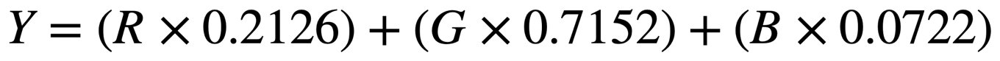
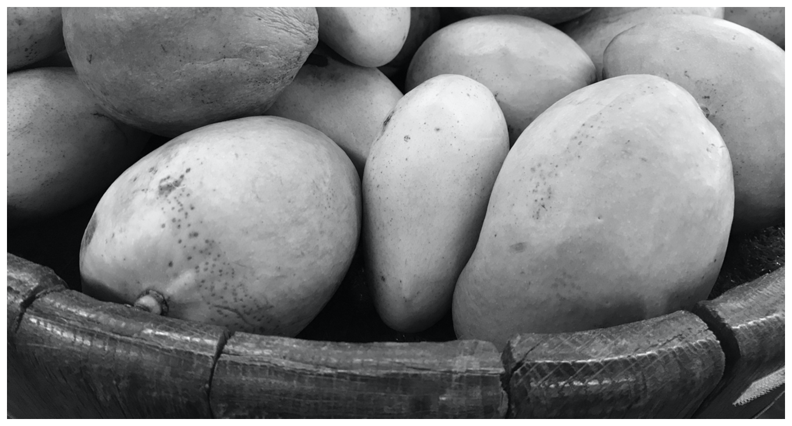

# Converting Color Images to Grayscale

Convert a color image to grayscale using matrix multiplication.

## Overview

In this sample code project, you'll convert a 3-channel 8-bit ARGB image to a 1-channel grayscale image by using a matrix of coefficients that define the color conversion.

vImage provides matrix multiplication operations that offer functionality analogous to the dot product (that is, returning the sum of the products of the corresponding elements in two vectors). [`vImageMatrixMultiply_ARGB8888ToPlanar8`](https://developer.apple.com/documentation/accelerate/1546979-vimagematrixmultiply_argb8888top) and [`vImageMatrixMultiply_ARGBFFFFToPlanarF`](https://developer.apple.com/documentation/accelerate/1546678-vimagematrixmultiply_argbfffftop) multiply each channel of an interleaved image with a value in a matrix and return the sum of the multiplications to a planar image.

The following shows how `vImageMatrixMultiply_ARGB8888ToPlanar8` calculates the result for each pixel:

```
let p = (sourcePixels[index].a + preBias.a) * matrix.a +
        (sourcePixels[index].r + preBias.r) * matrix.r +
        (sourcePixels[index].g + preBias.g) * matrix.g +
        (sourcePixels[index].b + preBias.b) * matrix.b

let destinationPixels[index] = (p + postBias) / divisor
```

## Define the Coefficient Values

Luma coefficients model an eye's response to red, green, and blue light. The following formula shows the Rec. 709 luma coefficients for the color-to-grayscale conversion, and it calculates luminance. In the formula, _Y_ represents the luminance of the red, green, and blue values:



The following shows how you declare the luma coefficients:

``` swift
let redCoefficient: Float = 0.2126
let greenCoefficient: Float = 0.7152
let blueCoefficient: Float = 0.0722
```

## Define the Coefficients Matrix

`vImageMatrixMultiply_ARGB8888ToPlanar8` accepts integer values for the matrix; multiply each fractional coefficient in the matrix by `divisor`:

``` swift
let divisor: Int32 = 0x1000
let fDivisor = Float(divisor)

var coefficientsMatrix = [
    Int16(redCoefficient * fDivisor),
    Int16(greenCoefficient * fDivisor),
    Int16(blueCoefficient * fDivisor)
]
```

The matrix multiply function requires an [`Int32`](https://developer.apple.com/documentation/swift/int32) `divisor`, but the coefficients are [`Float`](https://developer.apple.com/documentation/swift/float) values. To simplify the matrix initialization, declare and use `fDivisor` to multiply each coefficients by the divisor.

## Perform the Matrix Multiply

The color-to-grayscale calculation is the sum of the products of each color value and its corresponding coefficient, so define pre- and post-bias as zero. Call `vImageMatrixMultiply_ARGB8888ToPlanar8` to perform the matrix multiplication: 

``` swift
var preBias: Int16 = 0
let postBias: Int32 = 0

vImageMatrixMultiply_ARGB8888ToPlanar8(&sourceBuffer,
                                       &destinationBuffer,
                                       &coefficientsMatrix,
                                       divisor,
                                       &preBias,
                                       postBias,
                                       vImage_Flags(kvImageNoFlags))
```

On return, the `destinationBuffer` contains a grayscale representation of your original image.

## Create a Grayscale Core Graphics Image

Finally, you can create a 1-channel grayscale [`CGImage`](https://developer.apple.com/documentation/coregraphics/cgimage) instance from the destination buffer. The image format contains 8 bits per component and 8 bits per pixel. A single channel format has the same number of bits per pixel as bits per component.

``` swift
var monoFormat = vImage_CGImageFormat(
    bitsPerComponent: 8,
    bitsPerPixel: 8,
    colorSpace: Unmanaged.passRetained(CGColorSpaceCreateDeviceGray()),
    bitmapInfo: CGBitmapInfo(rawValue: CGImageAlphaInfo.none.rawValue),
    version: 0,
    decode: nil,
    renderingIntent: .defaultIntent)
```

To create the image, pass the destination buffer and grayscale format to [`vImageCreateCGImageFromBuffer`](https://developer.apple.com/documentation/accelerate/1399036-vimagecreatecgimagefrombuffer):

``` swift
let result = vImageCreateCGImageFromBuffer(
    &destinationBuffer,
    &monoFormat,
    nil,
    nil,
    vImage_Flags(kvImageNoFlags),
    nil)
```

On return, `result` contains a single-channel image that you can, for example, use to instantiate a `UIImage` instance and display onscreen:

``` swift
if let result = result {
    imageView.image = UIImage(cgImage: result.takeRetainedValue())
}
```


