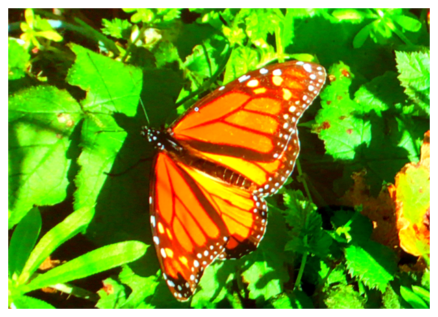
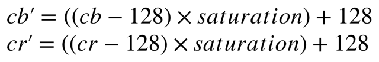
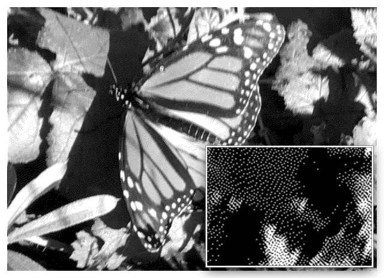
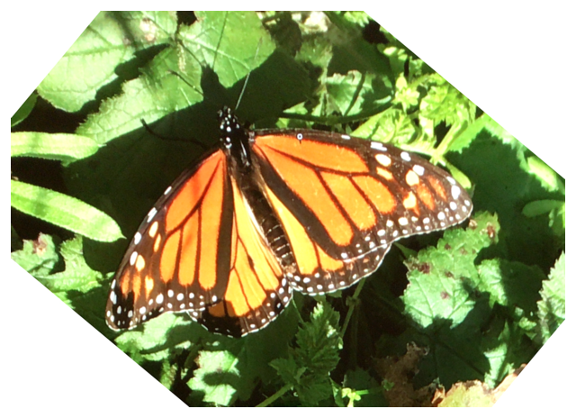
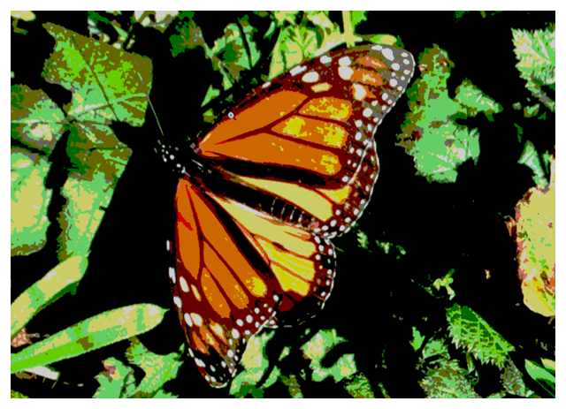

# Real-Time Video Effects with vImage

Use vImage to apply effects to a video feed in real time.

## Overview

This sample builds on the [Converting Luminance and Chrominance Planes to an ARGB Image](https://developer.apple.com/documentation/accelerate/vimage/converting_luminance_and_chrominance_planes_to_an_argb_image)
sample to leverage the lower-level, high-performance YpCbCr to RGB conversion functions provided by vImage to add additional, real-time video effects to a live camera stream.

Two effects are implemented in the YpCbCr color space:

* Saturation Adjustment.
* Dithering.

Two effects are implemented in the RGB color space:

* Rotation.
* Color quantization using lookup tables.

## Saturation Adjustment



You can easily adjust the color saturation of a YpCbCr image, without affecting its luminance, using the following formula:



You use the `vImageMatrixMultiply_Planar8` function to perform this math on the source chrominance buffer. The following code prepares the source chrominance buffer—which contains two planes for Cb and Cr—for use as the source and destination of the matrix multiply function:

``` swift
let chromaBufferPointer = withUnsafePointer(to: &sourceChromaBuffer) {
    return $0
}

var sources: UnsafePointer<vImage_Buffer>? = chromaBufferPointer
var destinations: UnsafePointer<vImage_Buffer>? = chromaBufferPointer
```

Pass the pre-bias (–128), and then multiply by the divisor both the post-bias (+128) and the saturation. The saturation is passed to the matrix multiply function as a single element matrix:

``` swift
var preBias: Int16 = -128
let divisor: Int32 = 0x1000
var postBias: Int32 = 128 * divisor

let saturation = mode == .dither ? 0 : fxValue

var matrix = [ Int16(saturation * Float(divisor)) ]
```

With the parameters prepared, call  `vImageMatrixMultiply_Planar8`  to perform the saturation adjustment formula to the chrominance planes:

``` swift
vImageMatrixMultiply_Planar8(&sources,
                             &destinations,
                             1,
                             1,
                             &matrix,
                             divisor,
                             &preBias,
                             &postBias,
                             vImage_Flags(kvImageNoFlags))
```

## Apply Dithering



In this sample, dithering is applied only to the luminance channel: converting the grayscale image to a pattern of black dots. To eliminate the chrominance information, the dithering step uses the previous saturation adjustment step, with the saturation set to zero. 

vImage provides dithering when reducing the bit depth of an image. In this sample, you convert the 8-bit luminance channel to a dithered 1-bit image, and then convert that back to 8-bit to pass to the YpCbCr to RGB function.

To create the 1-bit buffer, you initialize a `vImage_Buffer` structure, specifying one bit per pixel:

``` swift
var ditheredLuma = vImage_Buffer()
vImageBuffer_Init(&ditheredLuma,
                  sourceLumaBuffer.height,
                  sourceLumaBuffer.width,
                  1,
                  vImage_Flags(kvImageNoFlags))
```

vImage offers several dithering algorithms, this sample uses Atkinson dithering that’s specified by passing `kvImageConvert_DitherAtkinson` to the 8-bit to 1-bit conversion function. Because the luminance buffer is planar, use `vImageConvert_Planar8toPlanar1` to do the conversion:

``` swift
vImageConvert_Planar8toPlanar1(&sourceLumaBuffer,
                               &ditheredLuma,
                               nil,
                               Int32(kvImageConvert_DitherAtkinson),
                               vImage_Flags(kvImageNoFlags))

```

With `ditheredLuma` populated with the 1-bit dithered image, convert it back to 8-bit, specifying the original 8-bit luminance buffer, `sourceLumaBuffer`, as the destination:

``` swift
vImageConvert_Planar1toPlanar8(&ditheredLuma,
                               &sourceLumaBuffer,
                               vImage_Flags(kvImageNoFlags))
```

Once you’re finished with the 1-bit planar buffer, free its memory:

``` swift
free(ditheredLuma.data)
```

## Rotate the Image



vImage supports two types of specialized rotation functions—those that rotate an image in discrete 90º steps and those that rotate an image by an arbitrary angle. This sample uses the latter and specifies opaque white as the background color. Define the rotation, in radians, with the `fxValue` floating point variable::

``` swift
let backcolor: [UInt8] = [255, 255, 255, 255]
vImageRotate_ARGB8888(&destinationBuffer,
                      &destinationBuffer,
                      nil,
                      fxValue,
                      backcolor,
                      vImage_Flags(kvImageBackgroundColorFill))
```

## Quantize Color Using Lookup Tables



Mapping the individual channel values of an 8-bit per-channel image to a reduced set of values (for example, mapping the range 0…255 to the values `[0, 25, 50, 75, 100, 125, 150, 175, 200, 225, 255]`) decreases the number of distinct colors in an image. This process is known as color quantization and can be used for special effects or other applications such as compression.

vImage includes lookup table functions that provide this functionality. In this sample, generate the look up table dynamically based on a `quantizationLevel` value:

``` swift
var lookUpTable = (0...255).map {
    return Pixel_8(($0 / quantizationLevel) * quantizationLevel)
}
```

With a `quantizationLevel` value of 25, `lookUpTable` contains 25 of each of the values in `[0, 25, 50, 75, 100, 125, 150, 175, 200, 225, 255]`. Passing `lookupTable` as the red, green, and blue lookup table parameters to `vImageTableLookUp_ARGB8888` maps all of the red, green, and blue values between 0 and 24 to 0, between 25 and 49 to 25, between 50 and 74 to 50, and so on:

``` swift
vImageTableLookUp_ARGB8888(&destinationBuffer,
                           &destinationBuffer,
                           nil,
                           &lookUpTable,
                           &lookUpTable,
                           &lookUpTable,
                           vImage_Flags(kvImageNoFlags))
```

