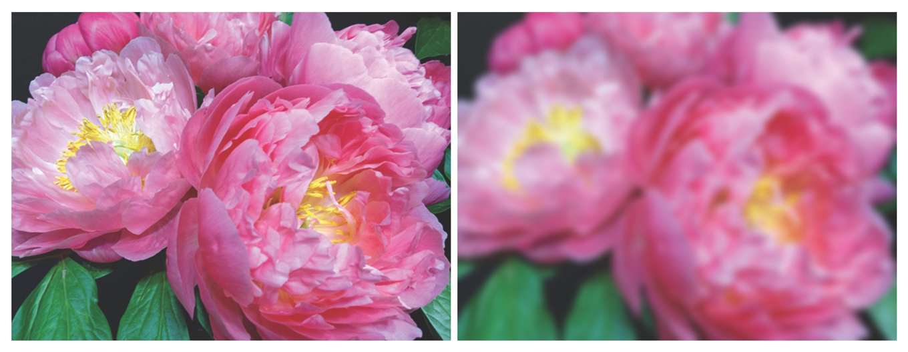

# Standardizing Arbitrary Image Formats for Processing

Convert assets with disparate color spaces and bit depths to a standard working format for applying vImage operations.

## Overview

To apply a vImage operation to an image, you must know its _bit depth_ (the number of bits required to represent each pixel) and its _color space_ (the number and organization of the color channels the image contains). For example, to apply an affine transform to a 32-bit image, you call `vImageAffineWarp_ARGBFFFF(_:_:_:_:_:_:)`. To apply the same transform to an 8-bit image, you call `vImageAffineWarp_ARGB8888(_:_:_:_:_:_:)`.

vImage's `vImageConvert_AnyToAny(_:_:_:_:_:)` function helps solve this issue by enabling you to dynamically create converters based on the properties of a source image. By converting all source assets to a standardized working format, you need only one operation.

This sample uses a vImage tent filter to apply a blur to  `UIImage` objects of arbitrary formats. Because a `UIImage` object can contain image data in many formats and color spaces, this implementation converts all input to 8-bit ARGB format before processing.

The example below shows an original 16-bit CMYK image on the left, and the same image converted to 8-bit ARGB and blurred on the right.



This sample walks you through the steps for applying a blur to an image of any format:

1. Implementing the blurring function.
2. Creating the source and destination image formats.
3. Creating the source and destination buffers.
4. Performing the conversion.
5. Applying the blur operation.
6. Returning the blurred result.
7. Using the blurring function.

## Implement the Blurring Function

The code to apply a blur to a `UIImage` instance with an arbitrary image format is implemented in  `blurImage(_:blurWidth:blurHeight:)`. This function accepts three parameters: the image to blur, and the width and height (in pixels) of the blur:

``` swift
func blurImage(_ sourceImage: UIImage,
               blurWidth: UInt32,
               blurHeight: UInt32) -> UIImage? {
```

## Create the Source and Destination Image Formats

To learn how to create a `vImage_CGImageFormat` structure from properties derived from the source image, see [Creating a Core Graphics Image Format](https://developer.apple.com/documentation/accelerate/vimage/creating_a_core_graphics_image_format). The properties of the source format are derived from source image. The properties of the destination format are hard coded to match the convolution operation used later in the function:

``` swift
guard
    let cgImage = sourceImage.cgImage,
    let sourceColorSpace = cgImage.colorSpace else {
        print("unable to initialize cgImage or colorSpace.")
        return nil
}

var sourceImageFormat = vImage_CGImageFormat(
    bitsPerComponent: UInt32(cgImage.bitsPerComponent),
    bitsPerPixel: UInt32(cgImage.bitsPerPixel),
    colorSpace: Unmanaged.passRetained(sourceColorSpace),
    bitmapInfo: cgImage.bitmapInfo,
    version: 0,
    decode: nil,
    renderingIntent: cgImage.renderingIntent)

var rgbDestinationImageFormat = vImage_CGImageFormat(
    bitsPerComponent: 8,
    bitsPerPixel: 32,
    colorSpace: nil,
    bitmapInfo: CGBitmapInfo(rawValue: CGImageAlphaInfo.first.rawValue),
    version: 0,
    decode: nil,
    renderingIntent: .defaultIntent)
```

## Create the Source and Destination Buffers

With the source and destination image formats defined, you create and initialize a buffer containing the source image, and a buffer that will contain the 8-bit, ARGB conversion of the source image. Be sure to free the memory allocated to these buffers when you're finished working with them by using the `free` function. Because `blurImage(_:blurWidth:blurHeight:)` may exit early, defer both of these free calls to ensure that they're always called.

``` swift
var sourceBuffer = vImage_Buffer()
var error = kvImageNoError

error = vImageBuffer_InitWithCGImage(&sourceBuffer,
                                     &sourceImageFormat,
                                     nil,
                                     cgImage,
                                     vImage_Flags(kvImageNoFlags))

guard error == kvImageNoError else {
    print("error in vImageBuffer_InitWithCGImage")
    return nil
}

defer {
    free(sourceBuffer.data)
}

var rgbDestinationBuffer = vImage_Buffer()

error = vImageBuffer_Init(&rgbDestinationBuffer,
                          sourceBuffer.height,
                          sourceBuffer.width,
                          rgbDestinationImageFormat.bitsPerPixel,
                          vImage_Flags(kvImageNoFlags))

guard error == kvImageNoError else {
    print("error in vImageBuffer_Init")
    return nil
}

defer {
    free(rgbDestinationBuffer.data)
}
```

## Perform the Conversion

The `vImageConvert_AnyToAny(_:_:_:_:_:)` function, that performs the conversion, requires a `vImageConverter` that describes the conversion. The `vImageConverter_CreateWithCGImageFormat(_:_:_:_:_:)` function creates this description based on the source and destination formats. Use `takeRetainedValue()` to acquire a managed reference of the conversion structure that `vImageConvert_AnyToAny(_:_:_:_:_:)` can consume.

``` swift
guard let toRgbConverter = vImageConverter_CreateWithCGImageFormat(
    &sourceImageFormat,
    &rgbDestinationImageFormat,
    nil,
    vImage_Flags(kvImagePrintDiagnosticsToConsole),
    nil)?.takeRetainedValue() else {
        print("error in vImageConverter_CreateWithCGImageFormat")
        return nil
        
}

error = vImageConvert_AnyToAny(
    toRgbConverter,
    &sourceBuffer,
    &rgbDestinationBuffer,
    nil,
    vImage_Flags(kvImagePrintDiagnosticsToConsole))

guard error == kvImageNoError else {
    print("error in vImageConvert_AnyToAny")
    return nil
}

```

After `vImageConvert_AnyToAny(_:_:_:_:_:)` has completed and `kvImageNoError` is returned, your destination buffer contains the image in 8-bit ARGB color space.

## Apply the Blur Operation

Create a blurred version of the converted image using vImage's tent filter. This filter calculates a weighted average of pixels within a surrounding grid, known as a kernel, with a size specified by the `blurWidth` and `blurHeight` parameters. The tent filter uses a fast algorithm that's suited for real-time applications.

Create a buffer to receive the tent filter's result using the same technique that you used for the other buffers. Be sure to free the buffer's memory when the you're finished using it.

The width and height values passed to `vImageTentConvolve_ARGB8888(_:_:_:_:_:_:_:_:_:)` must be odd so that the center of the kernel aligns with each pixel. To guarantee that the kernel sizes passed to the convolve function are odd, calculate `oddWidth` and `oddHeight` to add one to any even values passed into the function.

``` swift
var blurResultBuffer = vImage_Buffer()
error = vImageBuffer_Init(&blurResultBuffer,
                          sourceBuffer.height,
                          sourceBuffer.width,
                          rgbDestinationImageFormat.bitsPerPixel,
                          vImage_Flags(kvImageNoFlags))

guard error == kvImageNoError else {
    print("error in blurResultBuffer vImageBuffer_Init")
    return nil
}

defer {
    free(blurResultBuffer.data)
}

let oddWidth = blurWidth % 2 == 0 ? blurWidth + 1 : blurWidth
let oddHeight = blurHeight % 2 == 0 ? blurHeight + 1 : blurHeight

error = vImageTentConvolve_ARGB8888(&rgbDestinationBuffer,
                                    &blurResultBuffer,
                                    nil,
                                    0, 0,
                                    oddHeight, oddWidth,
                                    nil,
                                    vImage_Flags(kvImageEdgeExtend))

guard error == kvImageNoError else {
    print("error in vImageTentConvolve_ARGB8888")
    return nil
}
```

## Return the Blurred Result

After `vImageTentConvolve_ARGB8888(_:_:_:_:_:_:_:_:_:)` has completed, `blurResultBuffer` contains a blurred version of the original image. Your function creates a `CGImage` representation from the blurred result and returns a `UIImage` instance from that.

``` swift
if let cgImage = vImageCreateCGImageFromBuffer(&blurResultBuffer,
                                               &rgbDestinationImageFormat,
                                               nil,
                                               nil,
                                               vImage_Flags(kvImageNoFlags),
                                               nil) {
    return UIImage(cgImage: cgImage.takeRetainedValue())
} else {
    return nil
}
```

## Use the Blurring Function

This code shows an example usage of the `blurImage(_:blurWidth:blurHeight:)` function:

``` swift
let flowers = #imageLiteral(resourceName: "Flowers_2.jpg")

imageView.image = blurImage(flowers,
                            blurWidth: 48,
                            blurHeight: 48)
```
